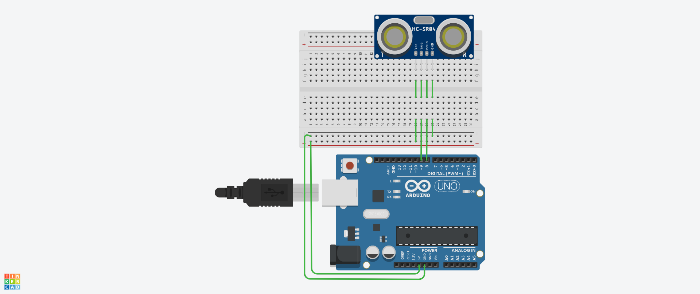
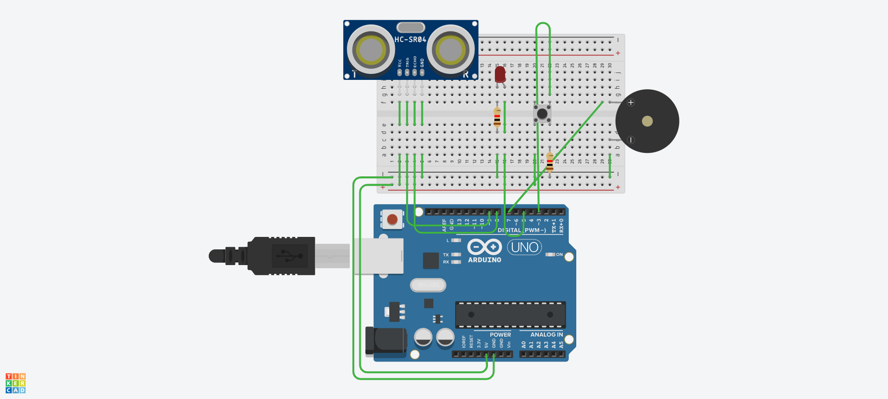

### Ultrasonic Sensor of Arduino
### 
1. Ultrasonic Testing Arduino
> [1] N0_brand Ultrasonic Hardware blink Example 
> [2] YES_brand Ultrasonic Hardware blink Example 
2. githublib Ultrasonic of Arduino
> [1-0] YES_github_Ultrasinuc.ino  
> [1-1] Github HomePage Download Zip file  
> [2-0] arduino.exe of Sketch of include lib of Add Zip library   
> [3-0] arduino.exe of arduino AVR feauture of port connected in Hardware 

### 
3. Piano ultrasonic of Arduino
> [1] Pinao_Ultrasonic.ino  
> [2] Pinao+LED_Ultrasonic.ino  
> [3] Pinao+LED+button_Ultrasonic.ino 
> [/] if of LED,button,buzzer 범위 결정  

3. Signal IR-Tracking of Arduino
> [1] IR-Tracking.ino  
> [2] LED_IR-Tracking.ino  
> [3] buzzer_IR-Tracking.ino 