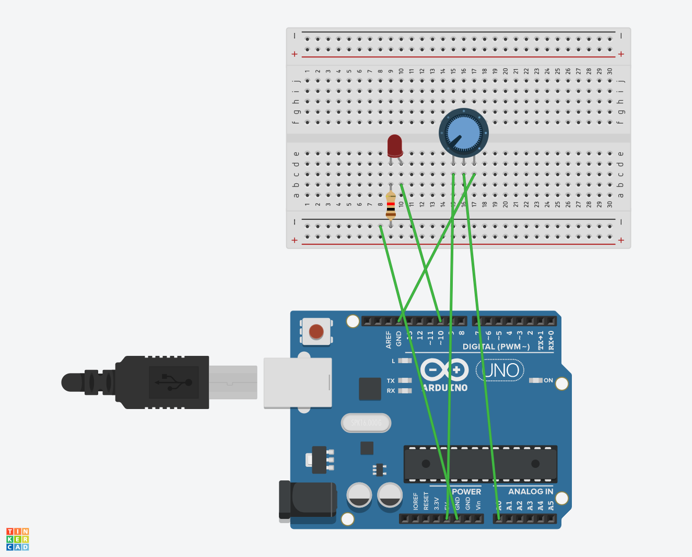

#### 아두이노로 이용한 LED_ON
1. LED_ON
> [1] blink를 이용한 테스트 핀 
2. LED_ON1
> [1] 스위치 제어 번호 : 3  
> [2] LED전구 스위치 : 5,6,7,8,9  
> [3] for문을 활용한 홀수짝수 핀  
3. LED_ON2
> [1] LED전구 스위치 : 2 ~ 9  
> [2] for문을 활용한 순차적인 가독성  
4. LED_ON3
> [1] int array[10] : 핀번호 정리  
> [2] LED전구 스위치 : 2 ~ 9  
> [3] for문을 활용한 순차적인 가독성  
5. LED_ON4 -> LED_ON ~ LED+ON3 

### 
### 6. LED_ON 5

> [1] analog Read 및 Write
> [2] 고정저항기 VS 가변저항기

 
